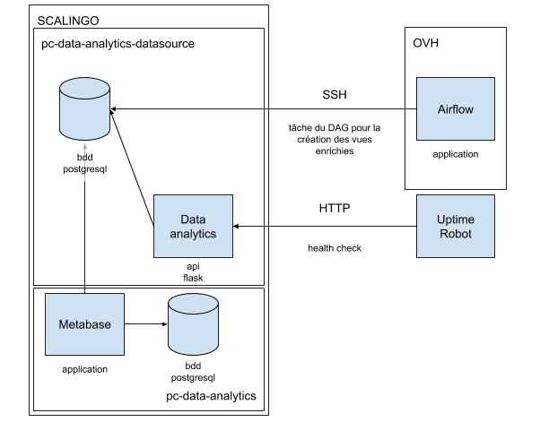

# pass-culture-data-analytics

C'est l'outil d'analyse de données du pass Culture.
Il est composé de :

- un postgresql basé sur celui de la prod et enrichi
- une app flask + une cli
- une app metabase qui rend ces données accessible aux équipes pass Culture



En local, vous avez le choix de faire tourner simplement Flask + Posgresql `make start-backend` ou tout metabase `make start-metabase`

Les commandes utiles au déveleppement se trouvent dans le Makefile ou dans la cli.

## Lancer les commandes relatives à l'environnement Data Analytics

### First setup

1. Cloner le repos
2. Ajouter ses variables d'environnment en local (voir ci-dessous)
3. `make start-metabase`
4. `make initialize-metabase`
5. Pour créer les tables enrichies la première fois `make create-enriched-views`
6. Pour vérifier `make tests`, tous ces tests devraient être verts (la création des vues enrichies n'est pas instantanée)
7. Avant de commit du code base, il faut lancer black pour bien formater le code `make format`

### Exemple de variables d'environnement en local :

Créer un fichier .env.local où on peut mettre ces variables d'environnements:

```
export METABASE_USER_NAME='admin@example.com'
export METABASE_PASSWORD='user@AZERTY123'
export METABASE_DBNAME='Produit'
export GREEN_DB_INFO='{
"app_name": "app-green",
"details": {
"port": "5432",
"host": "analytics-datasource-green-postgres",
"dbname": "pass_culture",
"user": "pass_culture",
"password": "passq"
}
}'

export BLUE_DB_INFO='{
"app_name": "app-blue",
"details": {
"port": "5432",
"host": "analytics-datasource-blue-postgres",
"dbname": "pass_culture",
"user": "pass_culture",
"password": "passq"
}
}'
```

## Simuler l'architecture fonctionnelle en local

### Pour démarrer tout Metabase en local

1. `cd pass-culture-data-analytics`
2. `make start-metabase`

### Pour démarrer uniquement les containers du backend

1. `cd pass-culture-data-analytics`
2. `make start-backend`

### Configurer Metabase en une commmande :

Ensuite exécuter les commandes suivantes :

1. `cd pass-culture-data-analytics`
2. Après un `make start-metabase`
3. lancer `make initialize-metabase`

L'url pour accéder à Metabase en local est : http://localhost:3002/, connectez vous avec METABASE_USER_NAME et METABASE_PASSWORD

### Configurer Metabase manuellement :

Pour configurer Metabase, il suffit de créer un compte admin, puis de se connecter à la base produit. Pour cela, il faut renseigner les informations suivantes :

- Choisir Postgresql comme type de base de données
- Name : Produit
- Host : analytics-datasource-blue-postgres
- Port : 5432
- Database name : pass_culture
- Database username : pass_culture
- Database password : passq

# Aide au développement

## Makefile

La plupart des commandes d'aide au développement (constuire les environnements, lancer les tests) se trouvent dans le Makefile, pour l'utiliser :

1. `cd pass-culture-data-analytics`
2. `make <command>`

### Accéder au résumé des commandes du Makefile

1. `make` ou `make help`

### Lancer la création des tables enrichies

Les tables enrichies sont utilisées pour augmenter les données de prod et permettre plus de traitements aux data-analystes.

On peut les créer via :

- le makefile :ou `make create-enriched-views`
- il est aussi possible de passer par le flask :
  `curl -X POST $DATA_ANALYTICS_DATASOURCE_URL?token=$DATA_ANALYTICS_TOKEN`
  Où `$DATA_ANALYTICS_DATASOURCE_URL` correspond à l'url de Metabase et `$DATA_ANALYTICS_TOKEN` au token d'authentification autorisant la création des tables enrichies

2. Il faut ensuite synchroniser la base sur metabase

- se rendre sur http://localhost:3002/admin/databases
- choisir la base à synchroniser (Produit)
- cliquer sur `Sync database schema now`
- vos tables enrichies sont maintenant accessibles

### Exécution des tests

Après avoir lancé les contenuers du backend, taper :
`make tests`
Certains tests échoueront tant que les vues enrichies n'ont pas été créées (cela peut prendre quelques secondes)

### Accéder à la base locale

1. `make access-database`

### Exécution de code python dans le container

1. `make run-python`

### Reset metabase

Supprime le volume lié au postgresql de metabase et reconstruit les environnements metabase (sans détruire les autres)

1. `make reset-metabase`
